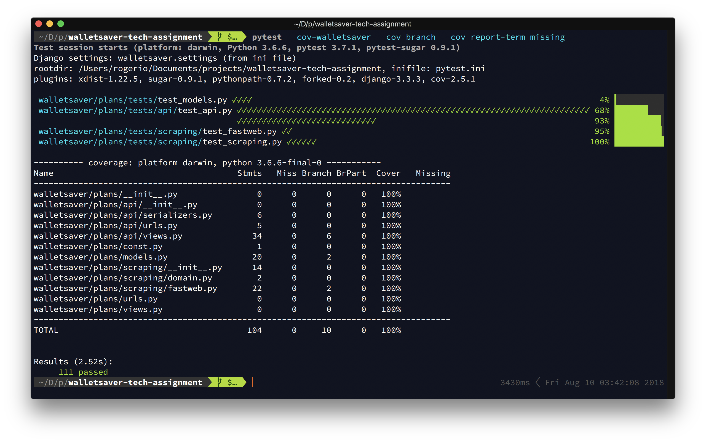
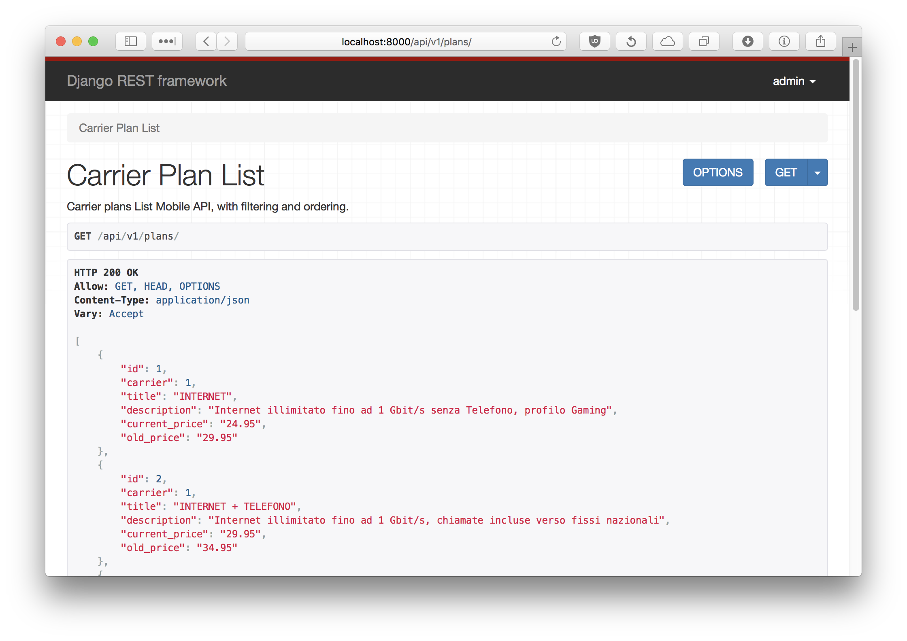

# Walletsaver - Tech assignment

Hello!
This is a nice challenge. And I mean even without the frontend!
I'll separate in sections, to better explain each development stage.


# Development process

## Environment

I use `pyenv`, it's very cool to be able to have several python versions available. And with the plugin `pyenv-virtualenv`, even the virtualenvs are taken care of.

So, I'll use python `3.6.5`, as the new `3.7` isn't available in pyenv yet.

This is what I did:

```bash
$ pyenv install 3.6.5
$ pyenv virtualenv 3.6.5 wsaver
$ cd <project-dir>
$ pyenv local wsaver
$ pip install -U pip
$ pip install -r requirements.txt
```

## Scraping

I've never scraped a site before.
After a few hours researching, I've found several alternatives like scrapy, lxml and beautifulsoup.

Scrapy seems to be a good choice for a company which does a lot of website crawling. It manages to provide a full ecosystem to fetch, process and persist data, as well as standardize tools like scrapyd to host "spyders" and a command line to easy deploy them.

The others seemed better to what I needed here. They're not a full blown system, they're frameworks. Both seemed ok, but I liked the beautifulsoup interface better (and I hate xml, would never pick the other anyway).
So, I've chosen beautifulsoup, as it seemed very easy to use.

The [https://www.fastweb.it](https://www.fastweb.it) page I needed to extract data from was very weird, at least to me, with untrained frontend eyes, with a bunch of spams intertwined together, with parts of text split in several of them.

But fortunately they weren't that hard to extract, I've initially made an imperative algorithm using for loops, but as I'm using a modern Python 3, I've challenged myself to do it in a functional style, using only iterators. It came out very neat and pythonic.


### Note: data synchronization and handling

In an actual production system, there would be another important part: updating these data seamlessly. The data already captured should be synchronized from time to time with the live one on the source site, minimizing dirty reads and downtime.
I would set up an asynchronous task handler like celery to run this task regularly, like once or twice a day.

To not ever removing data, as customers would probably have already chosen some of them, it would be necessary some versioning or expiry control, to be able to retrieve only current plans, without losing any history.

Also the software architecture implemented needed only a `CarrierPlan` model. A more complete system would probably have a `Carrier` model also.

Another consideration would be internationalization. The extracted data are in Italian, which may be fine for an italian company, with a customer base in Italy. But since the company is going to be global, there should be some way to translate these content.


## Web framework

I'll use Django, no doubt about it. I love Django.

Only I don't know the new Django 2.0, but it's a great opportunity to get to try it! :)


## Database

PostgreSQL is an easy choice too. Excellent database, and one I've already worked with.


## Docker infrastructure

Nowadays it's the best way to set up complex applications, without falling in a dependency hell.

I'll use `docker-compose` to get an up and running database, and the `adminer`, an open source admin interface compatible with Postgres.


## REST API (for mobile clients)

This were a tough one to choose. There's the famous `Django Rest Framework`, which I don't really like, and alternatives like the also famous `Restless` and `Tastypie`, or the bleeding edge `API Star`.

The DRF framework is complete, including an API browser, but I've always found it very convoluted. It tries to be so flexible that the usability suffers. But it is good nevertheless.

The `API Star` is not yet compatible with django, and the other two I've never used. I'll go with the DRF for now, maybe I change my mind.

In the end, I made the API a nice package inside the `plans` django app, complete with its own serializers, urls and views. This gives a cool separation between the views and urls of the app, which takes care of the frontend. Oh, and DRF wasn't that bad :)


## Tests

For this project, I've initially decided to experiment leaving the tests out of the python source code. This means a packaging process could only get the actual code, no tests whatsoever. The biggest advantage of this is eliminating the risk of importing and running them anywhere non local, which could wreak havoc in the db (been there, seen that).

Well, it does work, but when I got to the point of testing a django model, I've included the `factory-boy` dependency and created a "modelfactory", only to realize I couldn't import it in shell_plus... I had to go back and merge the tests again into the source.

So, to remove the tests from the actual code, the `Dockerfile` recipe would have to delete the tests directories after copying the source, which is a little harder.

Also, I had to include a new dependency `pytest-pythonpath` and create a `pytest.ini` to get the django settings to be found, it didn't find on their own.

Well, after all this, the tests were a great success! They were assembled with great care, all the possible edge cases covered (see the `api` tests)!

I was able to achieve 100% branch coverage :)




## Deploy

Django comes with a builtin test server, but in any non-local environment it won't quite meet minimum expectations. For that it would be needed a WSGI server, like `uWSGI` or `Unicorn`. The Web Server Gateway Interface specifies how a server should interact with a python application.

I'm not an expert DevOps, but in my last company, we encapsulated the app in a docker image comprised of a `uWSGI` server, and configured the concurrency to Fork Pool. Then, deployed in the same host another container with the full webserver nginx, acting as a reverse proxy, and enabling deploys with no downtime.

The deploy used a process split in two stages: the build-push, which built the new image and pushed to Docker Hub, and the pull-run, which fetched this new image in all hosts via Ansible, ran them along the prior one and changed the configuration of nginx, which would redirect requests to the new container. After that, it safely stopped and removed the old containers.

The scaling and load-balancing were also done manually. There was an `haproxy` deployed and monitored manually (yes, a SPOF) that would monitor health-checks and cpu loading of the current machine pool (say 20 hosts), and redirect requests in a sane way. The scaling was totally manual. If the current average loading was at 80% before the known rush hour of the day, someone would provision and run an `Ansible` playbook to bring up 10 hosts more. At the end of the day, you guessed it right, someone would again reclaim those machines, to keep the costs down.

Well, this all works, but it literally won't scale, and I wouldn't do that nowadays. The Amazon AWS now does provide a wonderful solution to this: the Elastic Container Service (ECS). It integrates nicely with the Elastic Load Balancer for distributing traffic behind containers, and does the autoscaling for clusters with fine grained configuration. The best thing of a service like ECS is that it lets us share some of the responsibility in keeping all of this running, monitoring resources usage, increasing and decreasing VMs as needed, etc. The most important aspect ECS thrives is user experience, keeping it as consistent as possible.

In any case, the process should be automated via a Continuous Integration tool, like CircleCI, Travis or Jenkins. The Amazon ECS services are specified by a "Task Definition" that defines things like environment variables, the container image to use, and the resources to allocate to the service (port, memory, CPU). And these task definitions could be created and registered through the very deployment process.


## Frontend


# How to use

I've written a `makefile`, to automate some common tasks, and make them simpler to use.
To see what tools are available, call `make` :)


## Initialize database

```bash
$ docker-compose up -d
$ make setupdb
$ walletsaver/manage.py migrate
```

Or simply

```bash
$ make resetdb
```

If you'd like to verify the database state,  enter `adminer` (the password is "wsaver4pwd"):

```bash
$ make adminer
```


## Run tests

```bash
$ pytest --cov=walletsaver --cov-branch --cov-report=term-missing
```

Or simply

```bash
$ make test
```


## Initialize data

Do you remember the scraping process, that I've explained should be scheduled to resync once or twice a day?
Well, here it is, manually initialized:

First enter the django shell:

```bash
$ walletsaver/manage.py shell_plus
```

Then scrape the fastweb site to fill our data model. You should obtain:

```python
In [1]: CarrierPlan.objects.resync_plans(carrier_id=1)

In [2]: CarrierPlan.objects.all()
Out[2]: <CarrierPlanQuerySet [<CarrierPlan: #1 fastweb:INTERNET>, <CarrierPlan: #2 fastweb:INTERNET + TELEFONO>, <CarrierPlan: #3 fastweb:INTERNET e Sky>, <CarrierPlan: #4 fastweb:INTERNET + TELEFONO e Sky>, <CarrierPlan: #5 fastweb:INTERNET + ENERGIA>, <CarrierPlan: #6 fastweb:INTERNET + TELEFONO + ENERGIA>]>
```


## Mobile API

Now finally run the server:

```bash
$ walletsaver/manage.py runserver
```

Go to the browser and enter:

```html
http://127.0.0.1:8000/api/v1/
```

You should see the browsable API from Django Rest Framework, nice stuff :)

Below is an example of the `/api/v1/list` api:




### API Help

The API is rooted in `/api/v1/`.
Here we have:

|HTTP VERB|URI|DESCRIPTION|
| :---: | :--- | --- |
|GET      | `plans` | List all plans, sorted by id.
|         |       |
|         |       | Query options:
|         |       |
|         |       |     `?price=[int[,int]]`
|         |       |         Filter the results by price range. If only one int
|         |       |         is provided, it is interpreted as the minimum price;
|         |       |         if both are provided, they represent a range of prices.
|         |       |         Both are **inclusive**.
|         |       |
|         |       |     `?sort=[name\|price][:[asc\|desc]]`
|         |       |         Sorts the results by name or price. If none of them is
|         |       |         provided, the results are sorted by id.
|         |       |         In any case, it's possible to suffix by :asc or :desc
|         |       |         to reverse results.
|         |       |
| GET     | `plans/<id>/` | Retrieves a particular plan by id.

As all entries of the API are read-only, it is not necessary to implement any authentication scheme, but even so the system was configured to `IsAuthenticatedOrReadOnly` to be safe. If the Mobile clients ever get an URI to buy things, this would be a must.

That's it, you can try and play with the browsable API, but rest assured it's working great, as the 100% code coverage guarantees :)
